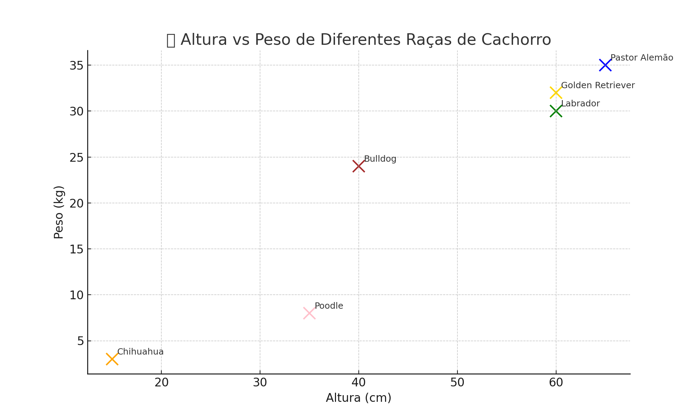

# 🐶 Análise de Raças de Cachorros: Altura vs Peso

Este gráfico mostra a relação entre a **altura (em cm)** e o **peso (em kg)** de diferentes raças de cães. Com ele, podemos identificar raças mais leves, mais pesadas, mais altas ou mais compactas.

---

## 📊 Gráfico

---

## 🔍 O que podemos observar:

- **Chihuahuas** são os mais leves e baixinhos.
- **Pastores Alemães** e **Golden Retrievers** são grandes e pesados.
- **Bulldogs** são baixos mas relativamente pesados para sua altura.
- **Labradores** e **Golden Retrievers** são parecidos em porte físico.

---

## 🧠 Conclusão:

Esse tipo de visualização ajuda muito a entender as diferenças morfológicas entre as raças e pode ser útil em contextos como:
- Treinamento físico para cães
- Escolha da raça ideal para um espaço limitado
- Planejamento de alimentação e cuidados veterinários

---
